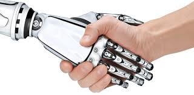

# 半年内学习、工作的建议内容                               

> 凡事预则立，不预则不立。

该[markdown格式](https://github.com/guodongxiaren/README)列表根据洪康杰同学的建议建立，由mutong维护；实践部分请惠彬原补充；各位同学可以在此基础上继续完善。
大三同学，要据此形成一个**有明确时间顺序的具体计划**。

## 目录
* [机器学习理论](#机器学习理论)
* [数学基础](#数学基础)
* [工程实践](#工程实践)
* [论文和讲座](#论文和讲座)
* [学习路线](#学习路线)
* [好东西一箩筐](#好东西一箩筐)

 
======

## 机器学习理论
> 内容建议：`1机器学习` + `2~6中任选` + `7深度学习`

#### 1、机器学习	
+ **课程视频：台湾大学[李宏毅](http://speech.ee.ntu.edu.tw/~tlkagk/)教授的[机器学习课程](https://www.youtube.com/watch?v=fegAeph9UaA&list=PLJV_el3uVTsPy9oCRY30oBPNLCo89yu49)**
+ 课程视频：[Andrew Ng](http://www.andrewng.org/)的在Stanford开设的[机器学习课程](https://www.youtube.com/watch?v=UzxYlbK2c7E&list=PLA89DCFA6ADACE599)

#### 2、强化学习
+ **图书：[Sutton](http://incompleteideas.net/sutton/)的[强化学习](http://incompleteideas.net/sutton/book/the-book.html)**
+ **课程视频：[David Siver](http://www.csml.ucl.ac.uk/people/silver/)的[强化学习](https://www.youtube.com/watch?v=2pWv7GOvuf0&list=PL7-jPKtc4r78-wCZcQn5IqyuWhBZ8fOxT)**
+ **实践环境：[OPENAI](https://openai.com/)**
+ github推荐：
  - [Implementation of Reinforcement Learning Algorithms](https://github.com/dennybritz/reinforcement-learning). Python, OpenAI Gym, Tensorflow. Exercises and Solutions to accompany Sutton's Book and David Silver's course.
  - [Python code for Reinforcement Learning: An Introduction](https://github.com/ShangtongZhang/reinforcement-learning-an-introduction)
  - [Minimal and Clean Reinforcement Learning Examples](https://github.com/rlcode/reinforcement-learning)
  - [Deep Reinforcement Learning Papers](https://github.com/dennybritz/reinforcement-learning)
  - [Awesome Reinforcement Learning](https://github.com/aikorea/awesome-rl)
+ 知乎推荐：
  - [Deep Reinforcement Learning Papers 2](https://zhuanlan.zhihu.com/p/23600620)

#### 3、图像处理
+ **课程视频：[Feifei Li](http://vision.stanford.edu/feifeili/)在Stanford开设的[面向可视化识别的卷积神经元网络](http://cs231n.stanford.edu/)**
+ 课程视频：UCF的CAP 5415 [Computer Vision](http://crcv.ucf.edu/courses/CAP5415/Fall2012/)
+ Youtube的[ComputerVisionFoundation频道](https://www.youtube.com/channel/UC0n76gicaarsN_Y9YShWwhw/playlists)

#### 4、自然语言处理
+ **课程视频：Chris Manning在Stanford开设的[自然语言处理及其深度学习方法](http://web.stanford.edu/class/cs224n/)**
+ 东北大学[朱靖波](http://www.cse.neu.edu.cn/TeacherSinglePage.aspx?teacher_id=a7aef635-aa4d-4c67-892b-6d32dac5d54c&navigation_id=798670aa-6c90-42a3-88de-42ca6e413ba6&module=%u6559%u5E08%u540D%u5F55)、[肖桐](http://www.cse.neu.edu.cn/TeacherSinglePage.aspx?teacher_id=338cc497-24c6-460d-a23f-1ab5a381e3f2&navigation_id=798670aa-6c90-42a3-88de-42ca6e413ba6&module=%u6559%u5E08%u540D%u5F55)老师的自然语言处理开源软件[小牛翻译](http://www.nlplab.com/NiuPlan/NiuTrans.ch.html)
+ 复旦大学[邱锡鹏](http://nlp.fudan.edu.cn/xpqiu/)的[自然语言处理开源书](https://github.com/nndl/nndl.github.io)

#### 5、迁移学习
+ 王晋东不在家的[迁移学习资料列表](https://github.com/wantingallin/transferlearning)

#### 6、推理与机器学习结合
+ 康奈尔大学的CS7792 [Counterfactual Machine Learning课件等资源](https://www.cs.cornell.edu/courses/cs7792/2016fa/)

#### 7、深度学习
+ **图书：GoodFello的[深度学习](http://www.deeplearningbook.org/)**
+ **课程视频：台湾大学[李宏毅](http://speech.ee.ntu.edu.tw/~tlkagk/)教授的[深度学习](https://www.youtube.com/watch?v=IzHoNwlCGnE&list=PLJV_el3uVTsPMxPbjeX7PicgWbY7F8wW9)**
+ 课程视频：多伦多大学[Hinton](http://www.cs.toronto.edu/~hinton/)教授的[深度学习](https://www.youtube.com/watch?v=cbeTc-Urqak&list=PLoRl3Ht4JOcdU872GhiYWf6jwrk_SNhz9)
+ [李沐](https://zhuanlan.zhihu.com/p/25099638)的[深度学习实践课程](http://zh.gluon.ai/index.html)
+ [深度学习与机器学习路线图](https://github.com/SherlockLiao/Roadmap-of-DL-and-ML/blob/master/README_cn.md)

## 数学基础	
+ **课程视频：Gilbert Strang在MIT开设的[线性代数](https://www.youtube.com/watch?v=ZK3O402wf1c&list=PL49CF3715CB9EF31D)带中文字幕的[网易云课堂](http://open.163.com/special/opencourse/daishu.html)**
+ **图书：清华大学张贤达的[《矩阵分析与应用（第2版）》](https://item.jd.com/11367945.html)**
+ *图书：美国工程院院士[Dimitri P. Bertsekas](http://www.mit.edu/~dimitrib/home.html)的[《Introduction to Probability》](https://item.jd.com/11842157.html)*
+ 免费电子书:Introduction to Calculus    [Volume I](http://www.math.odu.edu/~jhh/Volume-1.PDF)    [Volume II](http://www.math.odu.edu/~jhh/Volume-2.PDF)
+ Youtube上的视频：[essence of linear algebra](https://www.youtube.com/watch?v=kjBOesZCoqc&list=PLZHQObOWTQDPD3MizzM2xVFitgF8hE_ab)

## 工程实践
#### 1、工具和技能
+ **能熟练运用[Git](https://www.youtube.com/watch?v=kQSzft2Jj8Y&list=PLXO45tsB95cKysjmSNln65YoUt9lwEl7-)；**
+ **使用[Docker](https://www.youtube.com/watch?v=dlyMXkU2sBc&list=PLO5e_-yXpYLCd62cFFNQWdZmB1j6KhG9d);**
+ **掌握Python语言，熟悉各种常用工具** [教程1](https://github.com/jrjohansson/scientific-python-lectures)、[教程2](https://github.com/ipython-books/cookbook-code)、[教程3](https://github.com/DonJayamanne/pythonVSCode)、[教程4(中文)](https://github.com/lijin-THU/notes-python)、[教程5](https://github.com/donnemartin/data-science-ipython-notebooks)、[Cheatsheets](https://github.com/kailashahirwar/cheatsheets-ai)
  - Numpy [练习](https://github.com/Kyubyong/numpy_exercises)
  - Pandas [练习](https://github.com/guipsamora/pandas_exercises)
  - Matplotlib [教程](https://github.com/rougier/matplotlib-tutorial)
  - scipy [教程](https://hub.mybinder.org/user/elegant-scipy-notebooks-hjlhe570/notebooks/index.ipynb)
  - python [教程](https://www.amazon.com/Python-Tricks-Buffet-Awesome-Features/dp/1775093301/ref=sr_1_1?s=books&ie=UTF8&qid=1514033637&sr=1-1&keywords=python+tricks) [作者在youtube](https://www.youtube.com/channel/UCI0vQvr9aFn27yR6Ej6n5UA/playlists)
+ **会用Sklearn等机器学习工具包** [教程](https://github.com/pandas-dev/sklearn-pandas)
+ **掌握TensorFlow等深度学习框架**  [练习](https://github.com/Kyubyong/tensorflow-exercises) 
+ **阅读重要开源软件的源码；**
+ 掌握C/C++或Java语言。
#### 2、竞赛
+ [kaggle](https://www.kaggle.com/)
  - [Cdiscount’s Image Classification Challenge](https://www.kaggle.com/c/cdiscount-image-classification-challenge)
+ 李开复、搜狗王小川、今日头条张一鸣等发起的[全球AI挑战赛](https://challenger.ai/)
  - [图片场景分类](https://challenger.ai/competition/scene)
  - [骨骼关节点标注](https://challenger.ai/competition/keypoint)

## 论文和讲座
+ 阅读感兴趣方向的经典、或前沿的学术论文；
+ 定期对系列算法、方法、工程实践经验进行汇报讲座;
+ 建议用Endnote管理文献。

## 学习路线
+ 避免过拟合学习，避免贪多求全，尽量举一反三：Many could be better than all! [论证:joy:](https://pdfs.semanticscholar.org/1fbf/32e5312610fc575259640e1e5f2acf62e652.pdf)
+ 优先级：秉承由易到难的原则，**粗体**为现阶段必须学习内容。但是，数学基础无论如何也逃不过，逃不过啊，逃不过...
+ 视频课程选择标准：1）公认好课；2）难度与自我水平匹配；3）有课后作业，可以自动评判答案。
+ 视频课程不能取代阅读领域经典教材；学习教材的目的是为了得到良好知识体系，更快理解前沿学术论文；有突破性的idea不可能通过只读论文就得到，离开实验和实践的环节，所谓的灵感可能只是海市蜃楼般的错觉。读论文、做实验、读论文、做实验...biu...顶级论文（2030年）:joy:

## 好东西一箩筐
+ [嗖...](http://memect.com/)    [好东西传送门](http://weibo.com/haoawesome?refer_flag=1005055014_&is_hot=1)    [机器学习日报新版](http://forum.ai100.com.cn) 
+ [Paper weekly](http://rsarxiv.github.io/)
+ [知乎](www.zhihu.com)
+ [quora](https://www.quora.com/)
+ [videolectures](http://videolectures.net/)重要的机器学习、深度学习会议的演讲视频可以在这里找到。
+ [youtube](www.youtube.com)。知识与信息壁垒是发展最大的障碍。不想浸没在二手信息世界里，请穿墙而过，成为哈利波特大魔法师！
  - [周莫烦](https://www.youtube.com/user/MorvanZhou/playlists)。知乎大V。通俗易懂，看不下去论文的时候，找他。
  - [Siraj Raval](https://www.youtube.com/channel/UCWN3xxRkmTPmbKwht9FuE5A/playlists)。工程师届的著名演员和导演^-^。学术视频，大片质量；紧跟前沿，轻松诙谐；有一定深度。
  - [Sendex](https://www.youtube.com/user/sentdex)。实战狂人，实践入门最佳帮手。问题现说，代码现敲，说理透彻，产量极高。
  - [3Blue1Brown](https://www.youtube.com/channel/UCYO_jab_esuFRV4b17AJtAw)、[MathTheBeautiful](https://www.youtube.com/channel/UCr22xikWUK2yUW4YxOKXclQ/playlists)。相信我，你一定喜欢这些家伙讲数学的！！！
+ [github](www.github.com)。赶紧开设个账号，你最好的简历，可能就写在这里...
+ [Coursera](www.coursera.org)、[Edx](www.edx.org)、[Edxedge](https://edge.edx.org/login)、[**Udacity**](https://cn.udacity.com/)、[Udemy](https://www.udemy.com/)、[学堂在线](http://www.xuetangx.com/)。世界的大学，大师在线，永不谢幕！
